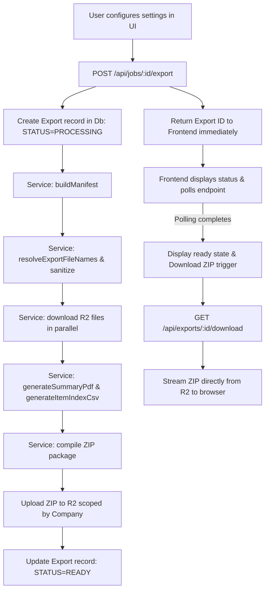

# Walkthrough - Export Job Package Feature

We have successfully implemented the **Export Job Package** (also known as **PM Handoff Package**) feature for JobBinder!

This walkthrough details the components built, database changes made, verification results, and how the architecture is laid out to support future export targets (like Google Drive and OneDrive).

---

## 🏗️ Architecture & Component Overview

The export system is engineered to be **fully asynchronous** and **destination-agnostic**. It separates manifest construction and file classification from destination writing, preventing serverless function timeouts on large exports and allowing simple future cloud integrations.



### 1. Database Schema
We added a new `Export` model to `prisma/schema.prisma` and synchronized the database using `npx prisma db push`:
- **`id`**: Unique identifier.
- **`jobId`**: Scoped to the job folder being exported.
- **`createdById`**: Records who generated the handoff.
- **`status`**: States (`PENDING`, `PROCESSING`, `READY`, `FAILED`).
- **`destination`**: Destination option used (`ZIP`).
- **`optionsJson`**: Tracks the selected filters and parameters used during generation.
- **`storageKey`**: The secure, company-scoped path of the zip in R2 (`{companyId}/exports/{exportId}.zip`).
- **`fileName`**: Clean user-facing name for the zip file.
- **`errorMessage`**: Detailed server-side error mapping in case of compilation failure.

---

### 2. Core Backend Service (`ExportJobPackageService.ts`)
Decoupled completely from Next.js server-specific details. It is reusable for local ZIP packaging, email delivery, or future cloud storage uploads:
- **`buildManifest`**: Gathers all files, notes (general and progress), and tasks (standard and punch list) from the database and filters them based on date range and category checkboxes. It classifies assets into folders:
  - `01 - Photos`
  - `02 - Punch List`
  - `03 - Progress Updates`
  - `04 - Daily Reports`
  - `05 - Material Tickets`
  - `06 - Notes`
  - `99 - Other`
- **`resolveExportFileNames`**:
  - Sanitizes invalid characters (`\`, `/`, `:`, `*`, `?`, `"`, `<`, `>`, `|`, `%`, `#`) with `-`.
  - Formats names to standard readable format: `YYYY-MM-DD - [Category] - [Short Title/Description] - [Original Name]`.
  - Detects name collisions in each subdirectory and appends duplicates sequentially: `[FileName] (2).jpg`, `[FileName] (3).jpg`.
- **`generateSummaryPdf`**: Generates a beautiful PDF (`00 - Job Summary.pdf`) using standard Helvetica embedding. It draws structured summaries, metadata stats, progress update paragraphs, and open punch lists, with automatic text-wrapping and multi-page overflow control.
- **`generateItemIndexCsv`**: Compiles `00 - Item Index.csv` listing all IDs, types, original/exported names, categories, and relative zip paths for auditing.
- **`generateZip`**: Fetches all binary objects from Cloudflare R2 in parallel using S3 client commands. It bundles them into a zip, handles any missing assets gracefully by compiling warnings inside `Export Warnings.txt`, and generates a Node-compatible Buffer.

---

### 3. API Routes
- **`POST /api/jobs/[id]/export`**: Validates authenticated company membership, creates the `Export` entry in `PROCESSING` status, kicks off the asynchronous pack-and-upload thread, and returns the tracking record immediately.
- **`GET /api/jobs/[id]/export`**: Handles status polling for the active export job.
- **`GET /api/exports/[id]/download`**: Strictly verifies that the authenticated user belongs to the company that created the export. Streams the ZIP file buffer directly from R2 to the browser as an attachment, keeping public URLs and storage keys secret.

---

### 4. Interactive Frontend UI
We added an **Export Job Package** action on the job detail screen:
- **Desktop button** in the secondary action cluster.
- **Mobile button** aligned perfectly as a full-width action below the grid.
- **Custom configurations** inside `ExportModal.tsx`:
  - Customizable Categories multiselect checkboxes.
  - Date boundary picker ("All time" or "Custom Range").
  - Formatting options (Include summary PDF, Include index CSV, Group by category, Rename files).
  - High-fidelity polling screens: "Preparing Export Package..." with animated loading loops.
  - Emerald download confirmation screen when the ZIP is compiled.

---

## 🧪 Verification & Test Results

### 1. Automated Tests
We created a comprehensive unit test suite in `src/lib/services/ExportJobPackageService.test.ts` verifying naming rules, character sanitization, and name collision.

All **82 tests** across **24 test files** passed successfully under `vitest`:
```bash
 ✓ src/lib/services/ExportJobPackageService.test.ts (3 tests) 5ms
     ✓ sanitizes invalid characters in filenames
     ✓ resolves duplicate file names within the same folder path
     ✓ keeps original filename if renameFilesForReadability is false
 
 Test Files  24 passed (24)
      Tests  82 passed (82)
   Duration  7.07s
```

### 2. Next.js Production Build
The entire codebase typechecks and builds perfectly with React 19/Next 16 under strict production compiler configurations:
```bash
▲ Next.js 16.2.6 (Turbopack)
  Creating an optimized production build ...
✓ Compiled successfully in 1741ms
  Running TypeScript ...
  Finished TypeScript in 2.6s ...
✓ Generating static pages using 15 workers (20/20)
Finalizing page optimization ...
```
All routes, including `/api/exports/[id]/download` and `/api/jobs/[id]/export` are compiling as dynamic on-demand endpoints (`ƒ`).

---

## 📂 Desired ZIP Folder Structure Example

When users extract the downloaded file, they get the following clean handoff:
```
Main Street Reconductoring - Export - 2026-05-20/
  ├── 00 - Job Summary.pdf           <-- Visual handoff summary
  ├── 00 - Item Index.csv            <-- Comprehensive PM file audit index
  ├── 01 - Photos/
  │   ├── 2026-05-18 - Photos - Pole 12 existing condition - IMG_4421.jpg
  │   └── 2026-05-19 - Photos - Final restoration - IMG_4490.jpg
  ├── 02 - Punch List/
  │   └── 2026-05-19 - Punch List - Missing caution tape - IMG_4428.jpg
  ├── 03 - Progress Updates/
  │   └── 2026-05-18 - Progress Updates - Pole transfer.txt
  └── Export Warnings.txt            <-- Generated only if R2 files are missing
```
